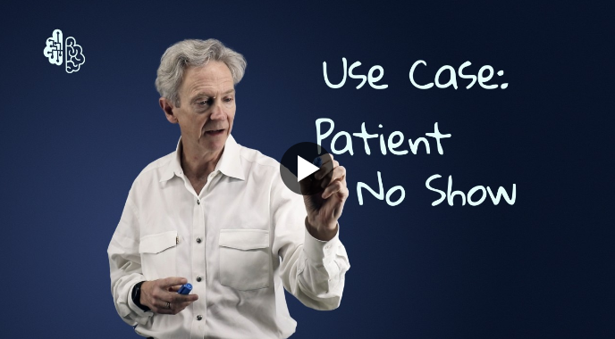

# Featured Materials

## Breaking News:

The works of patient no-show prediction off InterSystems IRIS data platform (with ML Toolkit added) in this excellent tutorial by Don Woodlock.

## Webinars

- [Online Meetup with the InterSystems AI Contest Winners](https://youtu.be/27vE9o9U3nM) on July 30th, 2021
- [AI+ML Summit Convergent Analytics – Healthcare Stream](https://youtu.be/yDRZwK3maeQ) on February 3rd, 2021
- [AI+ML Summit Convergent Analytics – Cross-Industry Stream](https://youtu.be/rRJ8_O4Y3gs) on January 28th, 2021
- [Best Practices of In-Platform AI/ML](https://youtu.be/N6tN48hCnE4) on April 28th, 2020
- [AI Robotization (Python, R, Interoperability) for InterSystems IRIS](https://youtu.be/-gyvCTBHh-0) on November 7th, 2019
- [Machine Learning Toolkit (Python, R, ObjectScript, Interoperability, Analytics) for InterSystems IRIS](https://youtu.be/z9O0F1ovBUY) on April 23rd, 2019

## Articles

- [Why AI-as-a-Service Requires an Integrated-from-Core Data Platform](https://www.linkedin.com/pulse/why-ai-as-a-service-requires-integrated-from-core-sergey-lukyanchikov/) as of September 27th, 2022
- [Agent IRIS*](https://www.linkedin.com/pulse/agent-iris-sergey-lukyanchikov/) as of February 1st, 2022
- [Distributed Artificial Intelligence with InterSystems IRIS](https://www.linkedin.com/pulse/distributed-artificial-intelligence-intersystems-iris-lukyanchikov/) as of April 6th, 2021
- [InterSystems IRIS – the All-Purpose Universal Platform for Real-Time AI/ML](https://www.linkedin.com/pulse/intersystems-iris-all-purpose-universal-platform-aiml-lukyanchikov/) as of September 20th, 2020
- [AI Robotization with InterSystems IRIS Data Platform](https://www.linkedin.com/pulse/ai-robotization-intersystems-iris-data-platform-sergey-lukyanchikov/) as of March 15th, 2020
- [MLOps can help overcome risk in AI and ML projects](https://dataconomy.com/2019/10/mlops-can-help-overcome-risk-in-ai-and-ml-projects/) as of October 30th, 2019
- [Python Gateway](https://community.intersystems.com/post/python-gateway-part-i-introduction) as of 12 April 2019

## Collaboration Experiences

- [An ML Toolkit for InterSystems IRIS: Co-Innovation in Healthcare](https://youtu.be/o0T0AgvxaNk) on September 25th, 2019
- [An ML Toolkit for InterSystems IRIS: Co-Innovation In Banking](https://youtu.be/pSMyKeuAZ80) on September 24th, 2019
- [Operationalizing Machine Learning: Experiences from the Field](https://youtu.be/8yN-rh5g21s) on September 23rd, 2019

## Tutorials

- [Learn IntegratedML in InterSystems IRIS](https://learning.intersystems.com/course/view.php?id=1346&ssoPass=1) on June 1st, 2020
- [Predictive Modeling with the Machine Learning Toolkit](https://learning.intersystems.com/course/view.php?id=1182&ssoPass=1) on September 23rd and 25th, 2019

## Demos

- [Simulation of 3 Interconnected Factories](https://www.linkedin.com/posts/lukyanchikov_agent-simulation-dataplatform-activity-7048985400312262656-ZSpe?utm_source=share&utm_medium=member_desktop) on April 4th, 2023
- Healthcare AI Solutions: [Readmission Prediction in IRIS & ML Toolkit](Readmission_Prediction_IRIS_ML_Toolkit.mp4) and [Readmission Prediction in TrakCare](Readmission_Prediction_TrakCare.mov) on November 3rd, 2021
- [ESKLP](https://openexchange.intersystems.com/package/ESKLP) on July 12th, 2020 | Acknowledgements: [Aleksandr Kalinin](https://github.com/drakut), Software Engineer, [Escape](http://esc.ru/), Russia
- [Machine Learning Made Easy - Advanced Exercise](https://github.com/renesto/mlmept2020) on July 6th, 2020
- [integratedml-demo-template](https://openexchange.intersystems.com/package/integratedml-demo-template) on June 15th, 2020
- [PythonGateway-Template](https://openexchange.intersystems.com/package/PythonGateway-Template) on May 29th, 2020
- [InterSystems IRIS Machine Learning Experience](https://github.com/renesto/MLExperience2019) on November 12th, 2019

# Links to Required Downloads

- `InterSystems IRIS Community Edition`: download a community edition of InterSystems IRIS data platform [here](https://evaluation.intersystems.com) - create an account to start the download
- `ML Toolkit: Python Gateway`: download an open-source set of extensions to InterSystems IRIS for in-platform orchestration of Python [here](https://openexchange.intersystems.com/package/PythonGateway)
- `ML Toolkit: R Gateway`: download an open-source set of extensions to InterSystems IRIS for in-platform orchestration of R [here](https://openexchange.intersystems.com/package/RGateway)
- `ML Toolkit: Julia Gateway`: download an open-source set of extensions to InterSystems IRIS for in-platform orchestration of Julia [here](https://github.com/intersystems-community/JuliaGateway)

# Repository Resources Legend
- `Programs`: program classes for pre-configured showcases
- `Data`: source data for showcases
- `Tables`: table classes for showcases

# Root Resources

- Download the illustrated ML Toolkit learning guide [here](ML_Toolkit_Fundamentals_v05_2.pdf) - for the most recent documentation and showcases, consider joining the private dedicated ML Toolkit repo by [writing us](mailto:MLToolkit@intersystems.com)
- Check how to edit BPL annotations [here](Annotation_Button.md)
- Check how to disable journaling [here](Stop_Journaling.md)
- Check how to disable auto-refresh [here](Stop_AutoRefresh.md)
- [AI+ Playlist from Virtual Summit 2021](https://github.com/intersystems-community/Convergent-Analytics/blob/master/AI%2B%20sessions%20at%20VS21%20v01.pdf)
- [AI+ Playlist from Virtual Summit 2020](https://github.com/intersystems-community/Convergent-Analytics/blob/master/AI%2B%20sessions%20at%20VS%20v05.pdf)

# Showcases (Programs/Data/Tables):

- 000 Robotized ML - `FACTORY.xml`/`FACTORY.zip`/`FACTORY.txt`
- 001 Sentiment Analysis - `SENTIMENT.cls`/`SENTIMENT_NEG_UTF8.txt`, `SENTIMENT_POS_UTF8.txt`, `SENTIMENT_UNK_UTF8.txt`/`SENTIMENTNEG.cls`, `SENTIMENTPOS.cls`, `SENTIMENTUNK.cls`
- 002 Engine Condition Classification - `ENGINES.cls`/`ENGINES_EVEN.txt`, `ENGINES_ODD.txt`/`ENGINESEVEN.cls`, `ENGINESODD.cls`
- 003 Reimbursement Request Check - `RECORD.cls`/`RECORD_TEST.txt`, `RECORD_TRAIN.txt`/`RECORDTEST.cls`, `RECORDTRAIN.cls`
- 004 Retail Cannibalization Analysis - `CANNIBALIZATION.cls`/`CANNIBALIZATION.txt`/`CANNIBALIZATIONVOLUMEYEARWEEKCATEGORYDESC.cls`
- 005 Marketing Campaign Optimization - `CAMPAIGN.cls`/`CAMPAIGN_APPLY.txt`, `CAMPAIGN_TRAIN.txt`/`CAMPAIGNAPPLY.cls`, `CAMPAIGNTRAIN.cls`
- 006 Rail Time Series Discovery - `INTRA.cls`/`INTRA.txt`
- 007 Housing Debts Prediction - `HOUSING.cls`/`HOUSING_TEST.txt`, `HOUSING_TRAIN.txt`/`HOUSINGTEST.cls`, `HOUSINGTRAIN.cls`
- 008 Diseases Network Analysis - `DISEASES.cls`/`DISEASES_MATRIX.txt`, `DISEASES_NODES.txt`/`DISEASESMATRIX.cls`, `DISEASESNODES.cls`